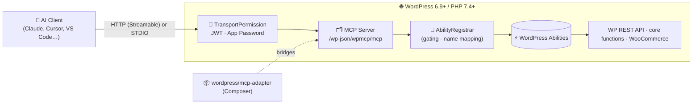
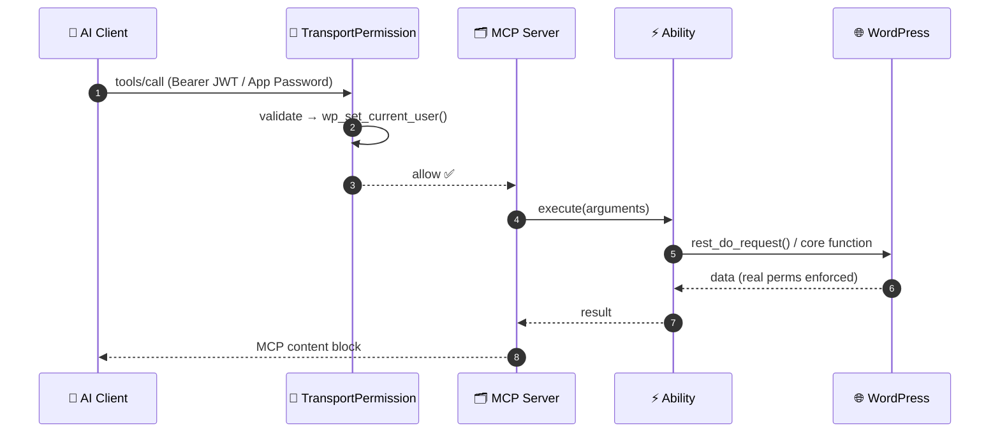

<div align="center">

# 🤖 WordPress MCP (Modern)

### Turn any WordPress site into a first-class **Model Context Protocol** server — built the *modern* way, on the WordPress **Abilities API**.

[](https://github.com/consigcody94/wordpress-mcp-modern/actions/workflows/ci.yml)
[](https://wordpress.org)
[](https://php.net)
[](https://github.com/WordPress/mcp-adapter)
[](https://modelcontextprotocol.io)
[](#-testing)
[](LICENSE)

<em>63 tools · 5 resources · 2 prompts · JWT + Application Password auth · HTTP &amp; STDIO transports · WooCommerce-aware</em>

</div>

---

## 📖 Table of contents

- [Why this exists](#-why-this-exists)
- [Architecture at a glance](#-architecture-at-a-glance)
- [Quick start](#-quick-start)
- [Connect your AI client](#-connect-your-ai-client)
- [Authentication](#-authentication)
- [What's exposed](#-whats-exposed)
- [Settings &amp; gating](#-settings--gating)
- [How it works](#-how-it-works)
- [Add your own tool](#-add-your-own-tool)
- [Testing](#-testing)
- [Migrating from Automattic/wordpress-mcp](#-migrating-from-automatticwordpress-mcp)
- [Project structure](#-project-structure)
- [Roadmap](#-roadmap)
- [License &amp; credits](#-license--credits)

---

## 💡 Why this exists

The original [`Automattic/wordpress-mcp`](https://github.com/Automattic/wordpress-mcp) is **deprecated**. Its successor is the official [`WordPress/mcp-adapter`](https://github.com/WordPress/mcp-adapter) AI Building Block, which sits on top of the new **[Abilities API](https://developer.wordpress.org/news/2025/11/introducing-the-wordpress-abilities-api/)** shipping in **WordPress Core 6.9**.

This project is a **ground-up re-implementation** of the old plugin's capabilities on that modern stack:

| Old way (deprecated) | Modern way (this plugin) |
| --- | --- |
| Bespoke `Mcp*Tools` PHP classes | Every capability is a **WordPress Ability** |
| Hand-rolled transport layer | The official **mcp-adapter** transport |
| Tightly coupled to MCP | Abilities are reusable by **any** AI building block |
| Monolithic plugin | Thin plugin + Composer dependency |

> **The big idea:** you don't register "tools" — you register **Abilities** (`wp_register_ability()`), and mcp-adapter exposes them as MCP tools, resources, and prompts. Same capability, many surfaces.

---

## 🏛️ Architecture at a glance



A connected client speaks MCP; mcp-adapter handles the protocol/transport; this plugin supplies the **Abilities** and decides which are exposed.

---

## 🚀 Quick start

> **Requirements:** WordPress **6.9+** (ships the Abilities API), PHP **7.4+**, Composer.

### Install into an existing site

```bash
cd wp-content/plugins/
git clone https://github.com/consigcody94/wordpress-mcp-modern.git
cd wordpress-mcp-modern
composer install --no-dev
wp plugin activate wordpress-mcp-modern
```

Your MCP endpoint is now live at **`/wp-json/wpmcp/mcp`**.

### Local development (Docker — no local PHP needed)

```bash
# 1. Install PHP deps via the Composer Docker image
docker run --rm -v "$PWD":/app -w /app composer:2 install

# 2. Spin up WordPress 7.0 + a tests env (uses Docker under the hood)
npx @wordpress/env start

# 3. Run the test suite
npx @wordpress/env run tests-cli \
  --env-cwd=wp-content/plugins/wordpress-mcp-modern \
  vendor/bin/phpunit
```

---

## 🔌 Connect your AI client

The server supports **HTTP (Streamable)** and **STDIO** transports.

<details>
<summary><strong>Claude Desktop / Cursor — via the official proxy + Application Password</strong></summary>

```jsonc
{
  "mcpServers": {
    "wordpress": {
      "command": "npx",
      "args": ["-y", "@automattic/mcp-wordpress-remote@latest"],
      "env": {
        "WP_API_URL": "https://your-site.com/wp-json/wpmcp/mcp",
        "WP_API_USERNAME": "your-username",
        "WP_API_PASSWORD": "xxxx xxxx xxxx xxxx xxxx xxxx"
      }
    }
  }
}
```
</details>

<details>
<summary><strong>VS Code — direct HTTP transport with a JWT</strong></summary>

```jsonc
{
  "servers": {
    "wordpress": {
      "type": "http",
      "url": "https://your-site.com/wp-json/wpmcp/mcp",
      "headers": { "Authorization": "Bearer <your-jwt>" }
    }
  }
}
```
</details>

<details>
<summary><strong>STDIO via WP-CLI (local)</strong></summary>

```bash
wp mcp-adapter serve --server=wpmcp-modern --user=admin
```
</details>

<details>
<summary><strong>Kick the tires with curl</strong></summary>

```bash
# initialize → grab the Mcp-Session-Id response header, then send it back on every call
curl -i -u "admin:APP_PASSWORD" -X POST https://your-site.com/wp-json/wpmcp/mcp \
  -H "Content-Type: application/json" \
  -H "Accept: application/json, text/event-stream" \
  -H "Mcp-Protocol-Version: 2025-06-18" \
  -d '{"jsonrpc":"2.0","id":1,"method":"initialize",
       "params":{"protocolVersion":"2025-06-18","capabilities":{},
                 "clientInfo":{"name":"curl","version":"0"}}}'
```
</details>

---

## 🔐 Authentication

Two interchangeable mechanisms, enforced by the server's transport-permission callback:

### 1. Application Passwords (recommended)
Standard WordPress HTTP Basic auth — zero extra setup. Create one under **Users → Profile → Application Passwords**.

### 2. JWT
Stateful, revocable HS256 tokens with a full management API:

| Route | Method | Who | Purpose |
| --- | --- | --- | --- |
| `/wp-json/jwt-auth/v1/token` | `POST` | anyone | Issue a token (current user, or `username`/`password`; optional `expires_in`) |
| `/wp-json/jwt-auth/v1/tokens` | `GET` | admin | List active tokens |
| `/wp-json/jwt-auth/v1/revoke` | `POST` | admin | Revoke by `jti` |

Send it as `Authorization: Bearer <jwt>`. Configure the signing secret with a constant in `wp-config.php` (otherwise one is auto-generated):

```php
define( 'WPMCP_JWT_SECRET_KEY', 'a-long-random-string' );
```

> 🛡️ Tokens are **stateful** — revocation works independently of expiry. (The legacy plugin documented `WPMCP_JWT_SECRET_KEY` but never read it; here it's honoured.)

You can also generate/list/revoke tokens from **Settings → WordPress MCP**.

---

## 🧰 What's exposed

**63 tools** (43 always-on + 20 WooCommerce when active), **5 resources**, **2 prompts**. Legacy tool names (`wp_posts_search`, `wc_get_product`, …) are preserved.

### 🔧 Tools

| Group | Count | Examples |
| --- | :---: | --- |
| 📝 Posts | 5 | `wp_posts_search`, `wp_get_post`, `wp_add_post`, `wp_update_post`, `wp_delete_post` |
| 📄 Pages | 5 | `wp_pages_search`, `wp_add_page`, `wp_update_page`, … |
| 🏷️ Taxonomy | 8 | `wp_list_categories`, `wp_add_category`, `wp_list_tags`, `wp_add_tag`, … |
| 👤 Users | 7 | `wp_users_search`, `wp_add_user`, `wp_get_current_user`, … |
| ⚙️ Settings | 2 | `wp_get_general_settings`, `wp_update_general_settings` |
| 🧩 Custom post types | 6 | `wp_list_post_types`, `wp_cpt_search`, `wp_add_cpt`, … |
| 🖼️ Media | 7 | `wp_list_media`, `wp_upload_media` (base64), `wp_get_media_file`, … |
| 🧭 Core (reused) | 3 | `get_site_info`, `get_user_info`, `get_environment_info` |
| 🛒 WooCommerce* | 20 | `wc_products_search`, `wc_add_product`, `wc_orders_search`, `wc_reports_sales`, … |
| 🧪 Generic (REST-CRUD mode) | 3 | `list_api_functions`, `get_function_details`, `run_api_function` |

<sub>*WooCommerce tools register only when WooCommerce is active. The generic REST-CRUD tools appear only in REST-CRUD mode (see below).</sub>

### 📚 Resources
`wordpress://site-info` · `wordpress://plugin-info` · `wordpress://theme-info` · `wordpress://user-info` · `wordpress://site-settings`

### 💬 Prompts
`get-site-info` · `analyze-sales`

---

## ⚙️ Settings & gating

Visit **Settings → WordPress MCP** to control exactly what's exposed:

- **Master enable** — toggle the whole MCP surface.
- **Create / Update / Delete gates** — read & action tools are always on; write tools are gated by type.
- **Per-tool toggles** — disable any individual tool.
- **🧪 REST-CRUD mode** — replaces the curated toolset with three generic "call any REST route" tools (`list_api_functions`, `get_function_details`, `run_api_function`), with per-method gating still enforced.

All gating is applied where the server is built, so disabled capabilities never reach a client.

---

## 🧠 How it works

Every capability is a **WordPress Ability**. mcp-adapter reads registered abilities and turns them into MCP components. Most tools use a small reusable factory, **`RestProxyAbility`**: it declares an explicit input schema but *executes* by dispatching through `rest_do_request()` — so the **real WordPress REST validation, sanitization, and permission checks run at call time** (high fidelity, low risk). Genuinely custom behaviour (custom post types over arbitrary types, base64 media upload, resources, prompts, the generic REST-CRUD tools) uses native abilities.



Two security layers always apply: the **transport permission** (server-wide) *and* each ability's own **permission callback** (per-capability).

---

## 🛠️ Add your own tool

Drop this in your own plugin or theme — it becomes an MCP tool automatically:

```php
add_action( 'wp_abilities_api_init', function () {
    wp_register_ability( 'my-plugin/word-count', array(
        'label'               => 'Word count',
        'description'         => 'Count the words in a post.',
        'category'            => 'my-plugin',
        'input_schema'        => array(
            'type'       => 'object',
            'properties' => array( 'id' => array( 'type' => 'integer' ) ),
            'required'   => array( 'id' ),
        ),
        'permission_callback' => fn() => current_user_can( 'read' ),
        'execute_callback'    => function ( $input ) {
            $post = get_post( (int) $input['id'] );
            return array( 'words' => str_word_count( wp_strip_all_tags( $post->post_content ) ) );
        },
        'meta' => array( 'mcp' => array( 'public' => true ) ),
    ) );
} );
```

> ℹ️ Ability **names must be dash-cased** (`my-plugin/word-count`) — the Abilities API rejects underscores. This plugin maps its own abilities back to legacy underscore *tool* names via the `mcp_adapter_tool_name` filter.

---

## 🧪 Testing

A full PHPUnit suite runs inside `@wordpress/env` against real WordPress:

```bash
npx @wordpress/env run tests-cli \
  --env-cwd=wp-content/plugins/wordpress-mcp-modern \
  vendor/bin/phpunit
```

```
OK (54 tests, 347 assertions)
```

Coverage spans every ability group (registration + execution round-trips), settings-driven gating, the REST-CRUD mode swap, and JWT issue/validate/revoke + the transport permission callback. CI runs the same suite on every push.

---

## 🔁 Migrating from Automattic/wordpress-mcp

| Concern | Change |
| --- | --- |
| Endpoint | `/wp/v2/wpmcp[/streamable]` → **`/wp-json/wpmcp/mcp`** |
| Tool names | **Preserved** (`wp_posts_search`, `wc_get_product`, …) |
| Auth | App Passwords **and** JWT both work; `jwt-auth/v1` routes mirror the legacy API |
| `WPMCP_JWT_SECRET_KEY` | Now actually **honoured** |
| Capabilities | Re-expressed as Abilities (reusable beyond MCP) |
| Known bugs | Fixed (e.g. the `get_function_details` shadowing bug, the unevaluated prompt `{{#if}}`) |

Full analysis and the design blueprint live in [`docs/superpowers/specs/`](docs/superpowers/specs).

---

## 📁 Project structure

```
wordpress-mcp-modern/
├── wordpress-mcp-modern.php          # bootstrap (guards, autoload, boot mcp-adapter)
├── composer.json                     # requires wordpress/mcp-adapter
├── includes/
│   ├── Plugin.php                    # wires all hooks
│   ├── Mcp/ServerProvider.php        # create_server(...) with gated ability lists
│   ├── Abilities/
│   │   ├── AbilityRegistrar.php      # single source of truth · gating · name mapping
│   │   ├── RestProxyAbility.php      # REST-proxy ability factory
│   │   ├── NativeAbility.php         # callback-backed ability
│   │   ├── ResourceAbility.php  ·  PromptAbility.php
│   │   └── {Content,Taxonomy,Users,Settings,Cpt,Media,Woo,Resource,Prompt,RestCrud}Abilities.php
│   ├── Auth/                         # JwtManager · JwtRestRoutes · TransportPermission
│   └── Admin/                        # SettingsStore · SettingsPage
├── tests/                            # PHPUnit (runs in wp-env)
└── docs/superpowers/specs/           # understanding + design docs
```

---

## 🗺️ Roadmap

- [ ] Binary image **content blocks** for `wp_get_media_file` (currently returns URL + metadata)
- [ ] WooCommerce **Brands** + order write tools
- [ ] Optional **React** settings UI for full visual parity
- [ ] Packaged release `.zip` + WordPress.org `readme.txt`

Contributions welcome — open an issue or PR. 💚

---

## 📜 License & credits

Licensed under **[GPL-2.0-or-later](LICENSE)**.

Built on the shoulders of [WordPress/mcp-adapter](https://github.com/WordPress/mcp-adapter), the [WordPress Abilities API](https://github.com/WordPress/abilities-api), and the [Model Context Protocol](https://modelcontextprotocol.io). Inspired by — and a migration target for — the now-deprecated [Automattic/wordpress-mcp](https://github.com/Automattic/wordpress-mcp).

<div align="center"><sub>Made for the WordPress + AI community.</sub></div>
