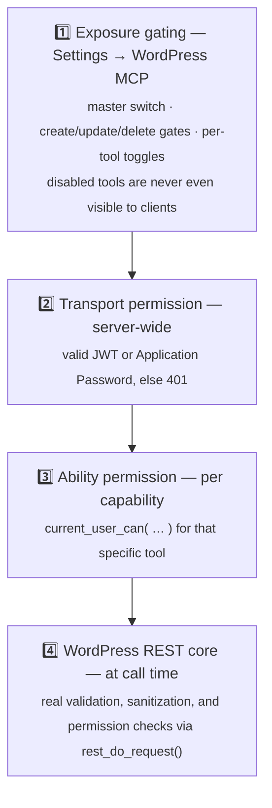
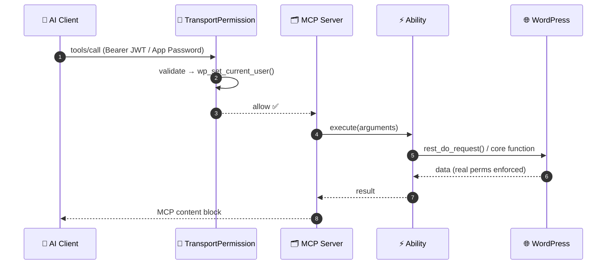

<div align="center">

# 🤖 WordPress MCP (Modern)

### Turn any WordPress site into a first-class **Model Context Protocol** server — built the *modern* way, on the WordPress **Abilities API**.

[](https://github.com/consigcody94/wordpress-mcp-modern/actions/workflows/ci.yml)
[](https://wordpress.org)
[](https://php.net)
[](https://github.com/WordPress/mcp-adapter)
[](https://modelcontextprotocol.io)
[](#-testing--development)
[](LICENSE)

| 🔧 **63** tools | 📚 **5** resources | 💬 **2** prompts | 🔐 **2** auth methods | 🔌 **2** transports | 🛒 WooCommerce-aware |
| :---: | :---: | :---: | :---: | :---: | :---: |

**[Quick start](#-quick-start)** · **[Connect a client](#step-3--connect-your-ai-client)** · **[Tools](#-whats-exposed)** · **[Security](#%EF%B8%8F-security--gating)** · **[Extend it](#%EF%B8%8F-add-your-own-tool)** · **[FAQ](#-faq--troubleshooting)**

</div>

---

## ✨ What is this?

This plugin makes your WordPress site **directly usable by AI assistants**. Once installed, tools like Claude Desktop, Cursor, or VS Code Copilot can securely read and manage your content — posts, pages, media, users, taxonomies, settings, even your WooCommerce store — by talking to your site over the open **Model Context Protocol (MCP)**.

In practice, that means conversations like these just *work*:

| 💬 You ask your AI… | ⚡ …and it calls |
| --- | --- |
| *"Draft a post announcing the spring sale and publish it."* | `wp_add_post` |
| *"What are my five most recent draft pages?"* | `wp_pages_search` |
| *"Upload this logo to the media library with proper alt text."* | `wp_upload_media` |
| *"How did the store do last month?"* | `wc_reports_sales` |
| *"Create a 'Tutorials' category and file the latest posts under it."* | `wp_add_category` + `wp_update_post` |

Everything runs under **your WordPress permissions** — the AI can never do anything the authenticated user couldn't already do, and you can gate or disable any tool from a settings page.

<details>
<summary><strong>🆕 New to MCP? A 60-second primer</strong></summary>

<br/>

The [Model Context Protocol](https://modelcontextprotocol.io) is an open standard (think *"USB-C for AI"*) that lets AI applications discover and call capabilities exposed by servers. An MCP server offers three kinds of things:

- **Tools** — actions the AI can take (*create a post, search users, upload media*).
- **Resources** — data the AI can read for context (*site info, active theme, settings*).
- **Prompts** — reusable, server-defined instruction templates (*"analyze my sales"*).

Your WordPress site becomes one of those servers. Any MCP-compatible client — Claude Desktop, Cursor, VS Code, or your own agent — can connect to it, see what it offers, and use it. The protocol handles discovery, schemas, and transport; this plugin supplies the WordPress capabilities.

</details>

---

## 💡 Why this exists

The original [`Automattic/wordpress-mcp`](https://github.com/Automattic/wordpress-mcp) is **deprecated**. Its successor is the official [`WordPress/mcp-adapter`](https://github.com/WordPress/mcp-adapter) AI Building Block, which sits on top of the new **[Abilities API](https://developer.wordpress.org/news/2025/11/introducing-the-wordpress-abilities-api/)** shipping in **WordPress Core 6.9**.

This project is a **ground-up re-implementation** of the old plugin's capabilities on that modern stack:

| | Old way (deprecated) | Modern way (this plugin) |
| --- | --- | --- |
| **Capabilities** | Bespoke `Mcp*Tools` PHP classes | Every capability is a **WordPress Ability** |
| **Transport** | Hand-rolled | The official **mcp-adapter** transport |
| **Reusability** | Tightly coupled to MCP | Abilities are reusable by **any** AI building block |
| **Shape** | Monolithic plugin | Thin plugin + Composer dependency |

> [!TIP]
> **The big idea:** you don't register "tools" — you register **Abilities** (`wp_register_ability()`), and mcp-adapter exposes them as MCP tools, resources, and prompts. Same capability, many surfaces. When the next AI surface arrives in WordPress, your abilities come along for free.

---

## 🏛️ Architecture at a glance


Each piece has one job:

- **`TransportPermission`** — the front door. Validates the JWT or relies on WordPress's own Application Password auth, then establishes the WordPress user for the request.
- **MCP Server** (from `wordpress/mcp-adapter`) — speaks the MCP protocol: discovery, sessions, schemas, content blocks. This plugin never parses MCP itself.
- **`AbilityRegistrar`** — the single source of truth for what's exposed. Applies your gating settings and maps modern ability names back to the legacy tool names clients already know.
- **Abilities** — the actual capabilities, registered via the core Abilities API and mostly executing through the real WordPress REST API.

---

## 🚀 Quick start

> [!IMPORTANT]
> **Requirements:** WordPress **6.9+** (ships the Abilities API) and PHP **8.0+**.

### Step 1 — Install the plugin

**From a release (easiest — no Composer needed):** grab `wordpress-mcp-modern.zip` from the [Releases page](https://github.com/consigcody94/wordpress-mcp-modern/releases) — it bundles all PHP dependencies — and install it via **Plugins → Add New → Upload Plugin**.

**From source:**

```bash
cd wp-content/plugins/
git clone https://github.com/consigcody94/wordpress-mcp-modern.git
cd wordpress-mcp-modern
composer install --no-dev
wp plugin activate wordpress-mcp-modern
```

Your MCP endpoint is now live at **`/wp-json/wpmcp/mcp`**. 🎉

### Step 2 — Create credentials

The fastest path is an **Application Password**: go to **Users → Profile → Application Passwords**, name it (e.g. `mcp`), and copy the generated password. That's it — no plugin configuration needed. (Prefer revocable tokens? See [Authentication](#-authentication) for JWTs.)

### Step 3 — Connect your AI client

The server supports **HTTP (Streamable)** and **STDIO** transports. Pick your client:

<details>
<summary><strong>🖥️ Claude Desktop / Cursor — via the official proxy + Application Password</strong></summary>

<br/>

Add this to your client's MCP config (e.g. `claude_desktop_config.json`):

```jsonc
{
  "mcpServers": {
    "wordpress": {
      "command": "npx",
      "args": ["-y", "@automattic/mcp-wordpress-remote@latest"],
      "env": {
        "WP_API_URL": "https://your-site.com/wp-json/wpmcp/mcp",
        "WP_API_USERNAME": "your-username",
        "WP_API_PASSWORD": "xxxx xxxx xxxx xxxx xxxx xxxx"
      }
    }
  }
}
```

The proxy bridges the client's STDIO transport to your site's HTTP endpoint and handles Basic auth for you.
</details>

<details>
<summary><strong>📝 VS Code — direct HTTP transport with a JWT</strong></summary>

<br/>

```jsonc
{
  "servers": {
    "wordpress": {
      "type": "http",
      "url": "https://your-site.com/wp-json/wpmcp/mcp",
      "headers": { "Authorization": "Bearer <your-jwt>" }
    }
  }
}
```
</details>

<details>
<summary><strong>⌨️ STDIO via WP-CLI (local / same machine)</strong></summary>

<br/>

```bash
wp mcp-adapter serve --server=wpmcp-modern --user=admin
```
</details>

### Step 4 — Verify it works

<details>
<summary><strong>🧪 Kick the tires with curl</strong></summary>

<br/>

```bash
# initialize → grab the Mcp-Session-Id response header, then send it back on every call
curl -i -u "admin:APP_PASSWORD" -X POST https://your-site.com/wp-json/wpmcp/mcp \
  -H "Content-Type: application/json" \
  -H "Accept: application/json, text/event-stream" \
  -H "Mcp-Protocol-Version: 2025-06-18" \
  -d '{"jsonrpc":"2.0","id":1,"method":"initialize",
       "params":{"protocolVersion":"2025-06-18","capabilities":{},
                 "clientInfo":{"name":"curl","version":"0"}}}'
```
</details>

Or simply ask your connected AI: *"What WordPress tools do you have?"* — it should list the toolset below.

---

## 🔐 Authentication

Two interchangeable mechanisms, enforced by the server's transport-permission callback. Use whichever fits:

| | 🔑 Application Passwords | 🎫 JWT |
| --- | --- | --- |
| **Setup** | None — built into WordPress | Issue via REST route or admin UI |
| **Format** | HTTP Basic auth | `Authorization: Bearer <jwt>` |
| **Lifetime** | Until you delete it | 1 hour by default, up to 30 days |
| **Revocation** | Delete from your profile | Instant, per-token (`jti`) — independent of expiry |
| **Best for** | Personal use, the proxy setup | Short-lived agents, CI, shared automations |

### Application Passwords (recommended start)

Standard WordPress HTTP Basic auth — zero extra setup. Create one under **Users → Profile → Application Passwords**.

### JWT

Stateful, revocable HS256 tokens with a full management API:

| Route | Method | Who | Purpose |
| --- | --- | --- | --- |
| `/wp-json/jwt-auth/v1/token` | `POST` | anyone | Issue a token (current user, or `username`/`password`; optional `expires_in`) |
| `/wp-json/jwt-auth/v1/tokens` | `GET` | admin | List active tokens |
| `/wp-json/jwt-auth/v1/revoke` | `POST` | admin | Revoke by `jti` |

Tokens default to a **1-hour** lifetime; you can request up to **30 days** via `expires_in` (the ceiling is filterable through `wpmcp_jwt_max_expiration_time`). Configure the signing secret with a constant in `wp-config.php` (otherwise one is auto-generated and stored):

```php
define( 'WPMCP_JWT_SECRET_KEY', 'a-long-random-string' );
```

> [!NOTE]
> 🛡️ Tokens are **stateful** — every token is recorded server-side, so revocation works immediately and independently of expiry. (The legacy plugin documented `WPMCP_JWT_SECRET_KEY` but never read it; here it's honoured.)

You can also generate, list, and revoke tokens visually from **Settings → WordPress MCP**.

---

## 🧰 What's exposed

**63 tools** (43 always-on + 20 WooCommerce when active), **5 resources**, **2 prompts**. Legacy tool names (`wp_posts_search`, `wc_get_product`, …) are preserved, so existing clients and prompts keep working.

### 🔧 Tools

| Group | Count | Examples |
| --- | :---: | --- |
| 📝 Posts | 5 | `wp_posts_search`, `wp_get_post`, `wp_add_post`, `wp_update_post`, `wp_delete_post` |
| 📄 Pages | 5 | `wp_pages_search`, `wp_add_page`, `wp_update_page`, … |
| 🏷️ Taxonomy | 8 | `wp_list_categories`, `wp_add_category`, `wp_list_tags`, `wp_add_tag`, … |
| 👤 Users | 7 | `wp_users_search`, `wp_add_user`, `wp_get_current_user`, … |
| ⚙️ Settings | 2 | `wp_get_general_settings`, `wp_update_general_settings` |
| 🧩 Custom post types | 6 | `wp_list_post_types`, `wp_cpt_search`, `wp_add_cpt`, … |
| 🖼️ Media | 7 | `wp_list_media`, `wp_upload_media` (base64 in), `wp_get_media_file` (URL + optional base64 out), … |
| 🧭 Core (reused) | 3 | `get_site_info`, `get_user_info`, `get_environment_info` |
| 🛒 WooCommerce* | 20 | `wc_products_search`, `wc_add_product`, `wc_orders_search`, `wc_reports_sales`, … |
| 🧪 Generic (REST-CRUD mode) | 3 | `list_api_functions`, `get_function_details`, `run_api_function` |

<sub>*WooCommerce tools register only when WooCommerce is active. The generic REST-CRUD tools appear only in REST-CRUD mode (see [Security & gating](#%EF%B8%8F-security--gating)).</sub>

### 📚 Resources

Read-only context the AI can pull in without a tool call:

`wordpress://site-info` · `wordpress://plugin-info` · `wordpress://theme-info` · `wordpress://user-info` · `wordpress://site-settings`

### 💬 Prompts

Server-defined prompt templates clients can offer as slash-commands or quick actions:

`get-site-info` · `analyze-sales`

---

## 🛡️ Security & gating

Defense in depth: a request passes through **four layers** before anything touches your data.



Control layer 1 from **Settings → WordPress MCP**:

- **Master enable** — toggle the whole MCP surface on/off.
- **Create / Update / Delete gates** — read & action tools are always on; write tools are gated by type, so you can run a read-only server with one click.
- **Per-tool toggles** — disable any individual tool.
- **🧪 REST-CRUD mode** — replaces the curated toolset with three generic "call any REST route" tools (`list_api_functions`, `get_function_details`, `run_api_function`), with per-method gating still enforced.

> [!NOTE]
> Gating is applied **where the server is built**, not filtered at call time — a disabled capability never appears in `tools/list`, so a client can't even attempt it. And because every tool runs as the authenticated WordPress user, an AI agent can never exceed the role of the account it connects with: connect with an Editor account and it simply cannot manage users or plugins.

---

## 🧠 How it works

Every capability is a **WordPress Ability**. mcp-adapter reads registered abilities and turns them into MCP components. Most tools use a small reusable factory, **`RestProxyAbility`**: it declares an explicit input schema (so the AI knows exactly what arguments to send) but *executes* by dispatching through `rest_do_request()` — so the **real WordPress REST validation, sanitization, and permission checks run at call time**. High fidelity, low risk, and no duplicated logic to drift out of sync with core.

Genuinely custom behaviour — custom post types over arbitrary types, base64 media upload, resources, prompts, the generic REST-CRUD tools — uses native abilities with hand-written callbacks instead.



---

## 🛠️ Add your own tool

This is the payoff of the Abilities architecture: **any plugin or theme can add MCP tools without knowing anything about MCP.** Register an ability, mark it public, done — it shows up in your AI client next to the built-ins:

```php
add_action( 'wp_abilities_api_init', function () {
    wp_register_ability( 'my-plugin/word-count', array(
        'label'               => 'Word count',
        'description'         => 'Count the words in a post.',
        'category'            => 'my-plugin',
        'input_schema'        => array(
            'type'       => 'object',
            'properties' => array( 'id' => array( 'type' => 'integer' ) ),
            'required'   => array( 'id' ),
        ),
        'permission_callback' => fn() => current_user_can( 'read' ),
        'execute_callback'    => function ( $input ) {
            $post = get_post( (int) $input['id'] );
            return array( 'words' => str_word_count( wp_strip_all_tags( $post->post_content ) ) );
        },
        'meta' => array( 'mcp' => array( 'public' => true ) ),
    ) );
} );
```

A good tool needs three things: a **clear description** (that's what the AI reads to decide when to use it), a **precise input schema** (that's how it knows what to send), and a **tight permission callback** (that's your safety net).

> [!WARNING]
> Ability **names must be dash-cased** (`my-plugin/word-count`) — the Abilities API rejects underscores. This plugin maps its own abilities back to legacy underscore *tool* names via the `mcp_adapter_tool_name` filter.

---

## 🧪 Testing & development

A full PHPUnit suite runs inside `@wordpress/env` against real WordPress — no mocks of core behaviour:

```bash
npx @wordpress/env run tests-cli \
  --env-cwd=wp-content/plugins/wordpress-mcp-modern \
  vendor/bin/phpunit
```

Coverage spans every ability group (registration + execution round-trips), settings-driven gating, the REST-CRUD mode swap, and JWT issue/validate/revoke + the transport permission callback. CI runs the same suite — plus a PHP syntax lint on the minimum and latest supported PHP — on every push and PR.

See [CONTRIBUTING.md](CONTRIBUTING.md) for the full development setup (Docker-only, no local PHP needed) and [CHANGELOG.md](CHANGELOG.md) for release history.

---

## 🔁 Migrating from Automattic/wordpress-mcp

Migration is designed to be a drop-in swap — your clients mostly only need the new endpoint URL:

| Concern | Change |
| --- | --- |
| Endpoint | `/wp/v2/wpmcp[/streamable]` → **`/wp-json/wpmcp/mcp`** |
| Tool names | **Preserved** (`wp_posts_search`, `wc_get_product`, …) |
| Auth | App Passwords **and** JWT both work; `jwt-auth/v1` routes mirror the legacy API |
| `WPMCP_JWT_SECRET_KEY` | Now actually **honoured** |
| Capabilities | Re-expressed as Abilities (reusable beyond MCP) |
| Known bugs | Fixed (e.g. the `get_function_details` shadowing bug, the unevaluated prompt `{{#if}}`) |

Full analysis and the design blueprint live in [`docs/superpowers/specs/`](docs/superpowers/specs).

---

## 📁 Project structure

```
wordpress-mcp-modern/
├── wordpress-mcp-modern.php          # bootstrap (guards, autoload, boot mcp-adapter)
├── composer.json                     # requires wordpress/mcp-adapter
├── includes/
│   ├── Plugin.php                    # wires all hooks
│   ├── Mcp/ServerProvider.php        # create_server(...) with gated ability lists
│   ├── Abilities/
│   │   ├── AbilityRegistrar.php      # single source of truth · gating · name mapping
│   │   ├── RestProxyAbility.php      # REST-proxy ability factory
│   │   ├── NativeAbility.php         # callback-backed ability
│   │   ├── ResourceAbility.php  ·  PromptAbility.php
│   │   └── {Content,Taxonomy,Users,Settings,Cpt,Media,Woo,Resource,Prompt,RestCrud}Abilities.php
│   ├── Auth/                         # JwtManager · JwtRestRoutes · TransportPermission
│   └── Admin/                        # SettingsStore · SettingsPage
├── tests/                            # PHPUnit (runs in wp-env)
└── docs/superpowers/specs/           # understanding + design docs
```

---

## ❓ FAQ & troubleshooting

<details>
<summary><strong>The admin shows "run composer install in the plugin directory"</strong></summary>

<br/>

You installed from a git clone without the PHP dependencies. Either run `composer install --no-dev` inside the plugin directory, or install the packaged zip from the [Releases page](https://github.com/consigcody94/wordpress-mcp-modern/releases), which bundles `vendor/`.
</details>

<details>
<summary><strong>The admin shows "requires the Abilities API (WordPress 6.9+)"</strong></summary>

<br/>

Your WordPress version predates the Abilities API. Upgrade core to 6.9 or later — the plugin deliberately stays inactive (rather than fataling) until the API is present.
</details>

<details>
<summary><strong>Every request returns 401 <code>wpmcp_unauthorized</code></strong></summary>

<br/>

The transport permission rejected the request. Check, in order: the credentials are valid (try them against `/wp-json/wp/v2/users/me`); the `Authorization` header actually reaches PHP — some Apache/FastCGI hosts strip it, which breaks both Basic auth and Bearer tokens; and for JWTs, that the token hasn't expired or been revoked (*"Token has been revoked or is unknown"* means it was — issue a new one).
</details>

<details>
<summary><strong>My client connects but sees no tools</strong></summary>

<br/>

Check **Settings → WordPress MCP**: the master switch may be off, the tool's create/update/delete gate disabled, or the individual tool toggled off. Gated tools are removed from discovery entirely, so this is the expected symptom. Also note WooCommerce tools only exist while WooCommerce is active.
</details>

<details>
<summary><strong>curl works for <code>initialize</code> but later calls fail</strong></summary>

<br/>

The HTTP transport is session-based: capture the `Mcp-Session-Id` response header from `initialize` and send it back as a request header on every subsequent call.
</details>

<details>
<summary><strong>Can the AI delete my whole site?</strong></summary>

<br/>

Only what the connected user's role allows, only through tools you've left enabled, and destructive tools are annotated so well-behaved clients ask before calling them. For maximum caution: connect a low-privilege user, switch off the delete gate, and you have a read-mostly server.
</details>

---

## 🗺️ Roadmap

- [x] Inline file data for `wp_get_media_file` (`include_data: true` → base64, size-capped via the `wpmcp_media_file_max_bytes` filter)
- [x] Packaged release `.zip` (built by the Release workflow on every `v*` tag) + WordPress.org `readme.txt`
- [ ] Native MCP image **content blocks** for media tools
- [ ] WooCommerce **Brands** + order write tools
- [ ] Optional **React** settings UI for full visual parity

Contributions welcome — see [CONTRIBUTING.md](CONTRIBUTING.md), or open an [issue](https://github.com/consigcody94/wordpress-mcp-modern/issues). 💚

---

## 📜 License & credits

Licensed under **[GPL-2.0-or-later](LICENSE)**.

Built on the shoulders of [WordPress/mcp-adapter](https://github.com/WordPress/mcp-adapter), the [WordPress Abilities API](https://github.com/WordPress/abilities-api), and the [Model Context Protocol](https://modelcontextprotocol.io). Inspired by — and a migration target for — the now-deprecated [Automattic/wordpress-mcp](https://github.com/Automattic/wordpress-mcp).

<div align="center"><sub>Made for the WordPress + AI community.</sub></div>
